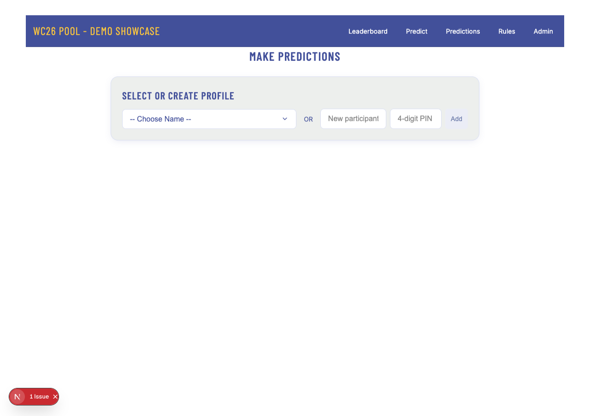
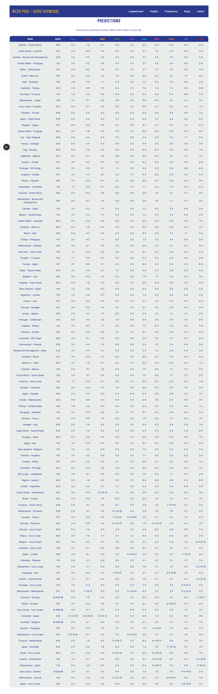

# WC26 Pool

Open-source World Cup 2026 prediction platform. Create a private league, share the link, and compete on every match.

**Live:** [wc26pool.vercel.app](https://wc26pool.vercel.app) (also [sleepwell-wc2026.vercel.app](https://sleepwell-wc2026.vercel.app))

## Screenshots

| Landing | Create league |
|---------|---------------|
|  |  |

| Leaderboard | Predict |
|-------------|---------|
|  |  |

| Picks grid | Rules |
|------------|-------|
|  |  |

## How it works

- **One global schedule** — 104 matches shared by all leagues (teams, kickoffs, bracket links).
- **Per-league users & predictions** — each league has its own players, PINs, and leaderboard.
- **Hybrid results** — the host league maintains the canonical World Cup scoreboard. Other leagues (local dev) can override results per match (`LeagueResultOverride`).

## Routes

| Path | Purpose |
|------|---------|
| `/` | Landing + public league directory |
| `/create` | Create a new league |
| `/{slug}` | League leaderboard |
| `/{slug}/predict` | Enter predictions (4-digit PIN) |
| `/{slug}/picks` | View everyone's picks |
| `/{slug}/rules` | Scoring rules |
| `/{slug}/admin` | Enter match results (league admin password) |

Legacy flat paths (`/predict`, `/admin`, etc.) redirect to the host league.

## Local QA: demo league (not deployed)

Multi-league behavior was verified locally with a **demo league only** — production does not include demo users or results.

```bash
# 1. Start dev (SQLite — see package.json db:local)
npm run dev

# 2. Seed global 104-match schedule once (host league admin → Seed Match Schedule)

# 3. Seed an isolated demo league (users, random picks, league-only results)
npx tsx scripts/seed-demo-league.ts
```

The demo script (`wc26-demo`):

- Creates 10 fictional players with independent random predictions
- Writes **league-only** result overrides — does **not** change the global scoreboard
- Confirms host-league scoring stays untouched when re-running the demo seed

Open `http://localhost:3000/wc26-demo` for leaderboard/picks; compare with the host league to confirm result isolation.

## Self-hosting

### Environment variables

| Variable | Required | Description |
|----------|----------|-------------|
| `DATABASE_URL` | Yes | PostgreSQL connection string (Neon, Supabase, Vercel Postgres, etc.) |
| `AUTH_SECRET` | Yes (prod) | Random string for signing session cookies |
| `HOST_LEAGUE_ADMIN_PASSWORD` | No | Override host admin password (default baked in for `/sleepwell`) |
| `HOST_LEAGUE_NAME` | No | Display name for host league (default: `SleepWell Fam`) |
| `HOST_LEAGUE_SLUG` | No | URL slug for host league (default: `sleepwell`) |

See [.env.example](.env.example). **Never commit real passwords or production URLs.**

### Local development

For quick local testing, you can use SQLite (`DATABASE_URL="file:./dev.db"`) and set `provider = "sqlite"` in `prisma/schema.prisma`. Production uses PostgreSQL.

```bash
npm install
npm run db:local    # SQLite only
npm run dev         # http://localhost:3000
```

**Before deploying**, ensure `prisma/schema.prisma` uses `provider = "postgresql"` and run `npm run build`.

### First-time match seed

An admin must seed the global 104-match schedule once: go to `/{host-slug}/admin`, log in, and click **Seed Match Schedule**. Match results start blank until entered.

### Clear all results (ops)

Host league admin → **Clear All Results** (wipes global scores and league overrides; predictions remain, points reset to 0).

For local/CI with database access:

```bash
DATABASE_URL=... npx tsx scripts/clear-match-results.ts
```

## Scripts

```bash
npm run dev      # development server
npm test         # vitest unit tests (39 tests)
npm run build    # prisma migrate deploy + next build (production)
npx tsx scripts/seed-demo-league.ts   # local demo only
```

## License

MIT — see [LICENSE](LICENSE).
