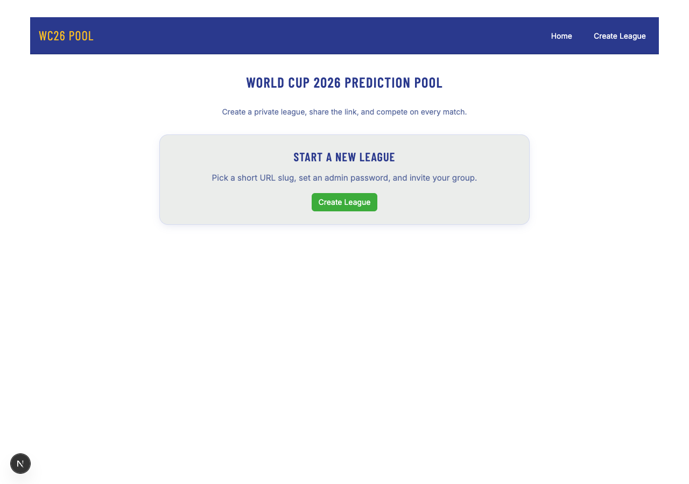
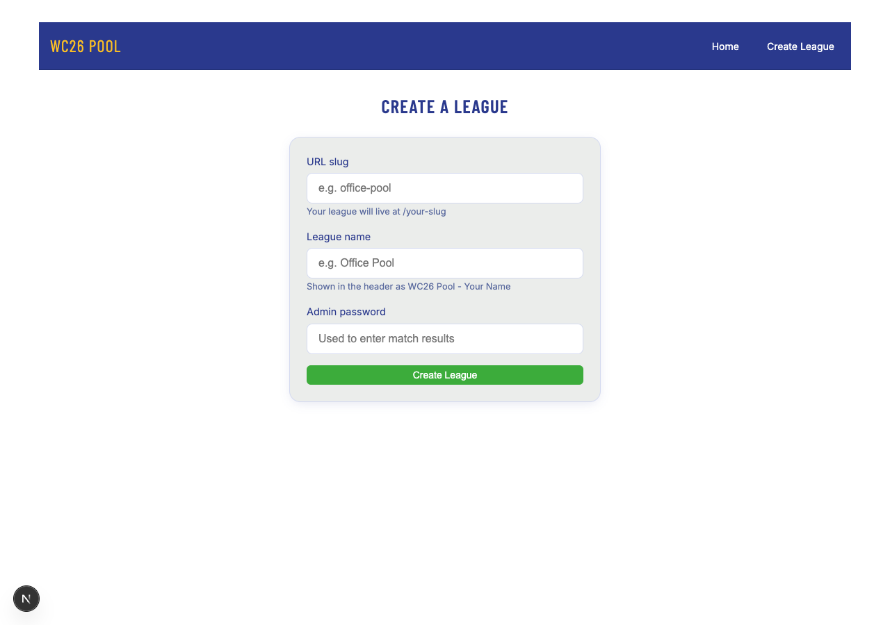
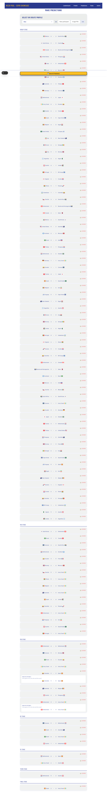
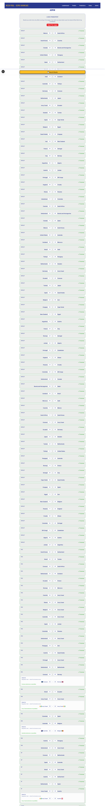
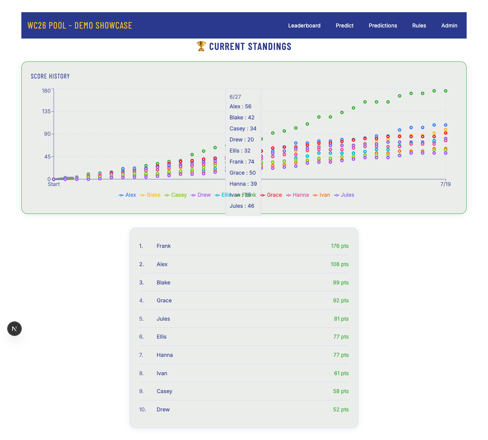
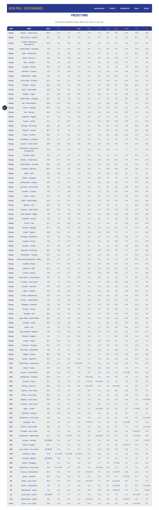
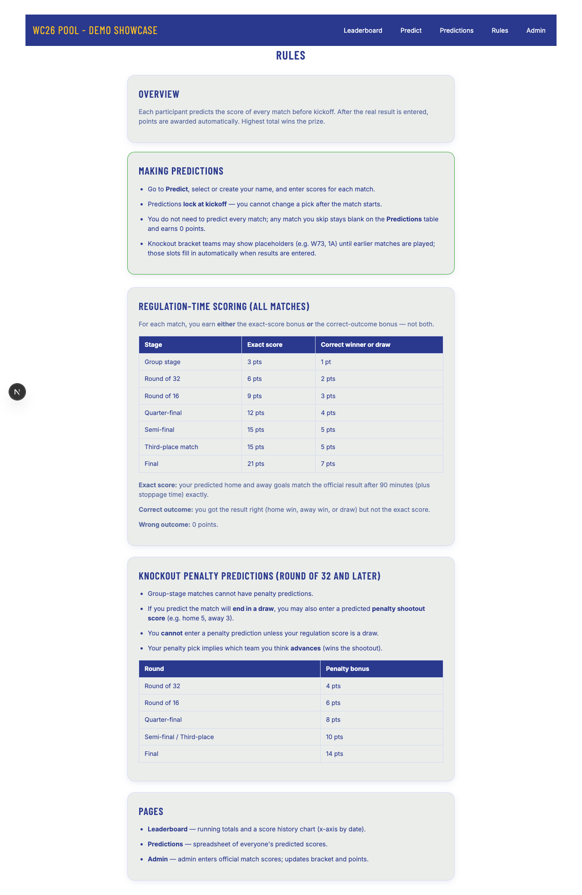

# WC26 Pool

**Live:** [wc26pool.vercel.app](https://wc26pool.vercel.app)

Open-source World Cup 2026 prediction platform. Create a private league, share the link, and compete on every match.

## Why this exists

Most tournament pools use a **fixed bracket** — you fill it out once before kickoff and then just watch. That works for a pre-tournament rush, but most of the World Cup happens *after* that moment. Group stages upset brackets, knockouts rewrite storylines, and a one-and-done pick sheet goes quiet for weeks.

WC26 Pool is built for **active participation across the whole tournament**:

- **Predict every match** — group stage through the final, not just a static bracket tree.
- **Score every result** — exact scores and correct outcomes earn points as matches finish.
- **Escalating knockout values** — later rounds are worth more (R32 → R16 → QF → SF → Final), so a rough group stage does not knock anyone out of the running. Comebacks stay plausible; the leaderboard stays tense.
- **League scoreboard + predictions table** — see who is winning and exactly what everyone picked, match by match.

The goal is a pool that stays fun for casual and competitive players alike — easy to join, hard to run away with early, and good fuel for friendly trash talk all month long.

## How it works

- **One global schedule** — 104 matches shared by all leagues (teams, kickoffs, bracket links).
- **Per-league players & predictions** — each league has its own participants, PINs, and leaderboard.
- **Hybrid results** — one canonical World Cup scoreboard drives default scoring; leagues can optionally override individual match results.

## Routes

| Path | Purpose |
|------|---------|
| `/` | Landing — start here to create a league |
| `/create` | Create a new league |
| `/{slug}` | League leaderboard |
| `/{slug}/predict` | Enter predictions (4-digit PIN) |
| `/{slug}/picks` | Predictions table — everyone's picks by match |
| `/{slug}/rules` | Scoring rules |
| `/{slug}/admin` | Enter match results (league admin password) |

## Self-hosting

### Environment variables

| Variable | Required | Description |
|----------|----------|-------------|
| `DATABASE_URL` | Yes | PostgreSQL connection string (Neon, Supabase, Vercel Postgres, etc.) |
| `AUTH_SECRET` | Yes (prod) | Random string for signing session cookies |
| `HOST_LEAGUE_ADMIN_PASSWORD` | No | Admin password for the canonical scoreboard league |
| `HOST_LEAGUE_NAME` | No | Display name for the host league |
| `HOST_LEAGUE_SLUG` | No | URL slug for the host league |

See [.env.example](.env.example). **Never commit real passwords or production URLs.**

### Local development

For quick local testing, use SQLite (`DATABASE_URL="file:./dev.db"`) and set `provider = "sqlite"` in `prisma/schema.prisma`. Production uses PostgreSQL.

```bash
npm install
npm run db:local    # SQLite only
npm run dev         # http://localhost:3000
```

**Before deploying**, ensure `prisma/schema.prisma` uses `provider = "postgresql"` and run `npm run build`.

### First-time match seed

A host-league admin must seed the global 104-match schedule once: open `/{host-slug}/admin`, log in, and click **Seed Match Schedule**. Match results start blank until entered.

### Clear all results (ops)

Host league admin → **Clear All Results** (wipes global scores and league overrides; predictions remain, points reset to 0).

For environments with direct database access:

```bash
DATABASE_URL=... npx tsx scripts/clear-match-results.ts
```

## Scripts

```bash
npm run dev      # development server
npm test         # vitest unit tests (39 tests)
npm run build    # prisma migrate deploy + next build (production)
```

## Screenshots

| Landing | Create league |
|---------|---------------|
|  |  |

| Predict (unlocked) | Admin (logged in) |
|--------------------|-------------------|
|  |  |

| Leaderboard | Predictions |
|-------------|-------------|
|  |  |

| Rules |
|-------|
|  |

## License

MIT — see [LICENSE](LICENSE).
